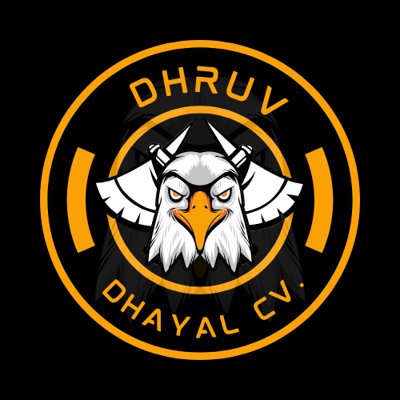

# MY-RESUME-VER.2
My Resume will define my skill and Experience as well as my projects.

----------------------------------------------------------------------------------

  

----------------------------------------------------------------------------------
 
Certainly! Below is a sample LinkedIn post that you can use to showcase your resume ver.2 project:

---

🌟 Excited to share my latest project - Resume ver.2! 🚀

👨‍💻 As a web developer passionate about creating engaging user experiences, I've revamped my resume using the latest web technologies - HTML, CSS, JavaScript, and even Node.js!

🌙 One of the coolest features? It comes with a proper night vision dark mode display, making it easy on the eyes for late-night browsing. 🌚

📝 In this project, I've highlighted all my experiences and strengths in a visually appealing format, complete with emojis and sequential bullet points. From frontend development with HTML, CSS, and JavaScript to backend work with Node.js, this resume reflects my diverse skill set and passion for creating impactful digital solutions.

🔗 Check out the live version of Resume ver.2 here: [Link to your resume]

💼 Are you looking for a web developer who's committed to delivering high-quality projects with creativity and innovation? Let's connect and chat about how I can bring value to your team! 

#WebDevelopment #Resume #HTML #CSS #JavaScript #NodeJS #NightVision #DarkMode #DigitalInnovation #WebDeveloper #CreativeSolutions

---

Feel free to customize this post with your personal touch and any additional details you'd like to include. Happy networking!
 
----------------------------------------------------------------------------------

  

----------------------------------------------------------------------------------
 

--------------------------- Details!--------------------------------------

Certainly! Let's break down the LinkedIn post into bulleted points with emojis and complete details for each section:

---

🌟 **Introduction:**

- Excited to introduce my latest project - Resume ver.2! 🚀
- Showcasing my expertise in web development with a modern and interactive resume experience.

🌙 **Night Vision Dark Mode:**

- Implemented a proper night vision dark mode display for enhanced readability during late-night browsing. 🌚
- Carefully designed to reduce eye strain and provide a comfortable viewing experience.

📝 **Experience Section:**

- **Frontend Developer at ABC Web Solutions:** Spearheaded the development of responsive web applications using HTML, CSS, and JavaScript.
- **Key Responsibilities:**
  - Developed engaging user interfaces and implemented UI features and animations.
  - Collaborated closely with design teams to ensure brand consistency and a seamless user experience.

🚀 **Strengths Section:**

- **Technical Proficiencies:**
  - Proficient in HTML, CSS, JavaScript, and Node.js. 🖥️
  - Experienced in modern frontend frameworks like React.js and Vue.js.
- **Additional Skills:**
  - Strong understanding of backend development with Node.js.
  - Familiarity with version control systems like Git.

🔗 **Live Version:**

- Curious to explore Resume ver.2 in action? Click here to view the live version: [Link to your resume]

💼 **Call to Action:**

- If you're seeking a dedicated web developer committed to delivering innovative solutions and driving digital transformation, let's connect! I'm eager to explore how I can contribute to your team's success.

🌐 **Hashtags:**

- #WebDevelopment #Resume #HTML #CSS #JavaScript #NodeJS #NightVision #DarkMode #DigitalInnovation #WebDeveloper #CreativeSolutions

---

Feel free to utilize these bulleted points in your LinkedIn post, providing a concise yet comprehensive overview of your Resume ver.2 project. Adjust the language and details as needed to reflect your unique experiences and style.

----------------------------------------------------
Github: https://github.com/BlockNotes-4515 
Linkdin: https://www.linkedin.com/in/dhruv-dhayal-9568b7262/ 
Instagram: https://www.instagram.com/dhayaldhruv271/ 
Twitter: https://twitter.com/DhayalDhruv 
----------------------------------------------------

